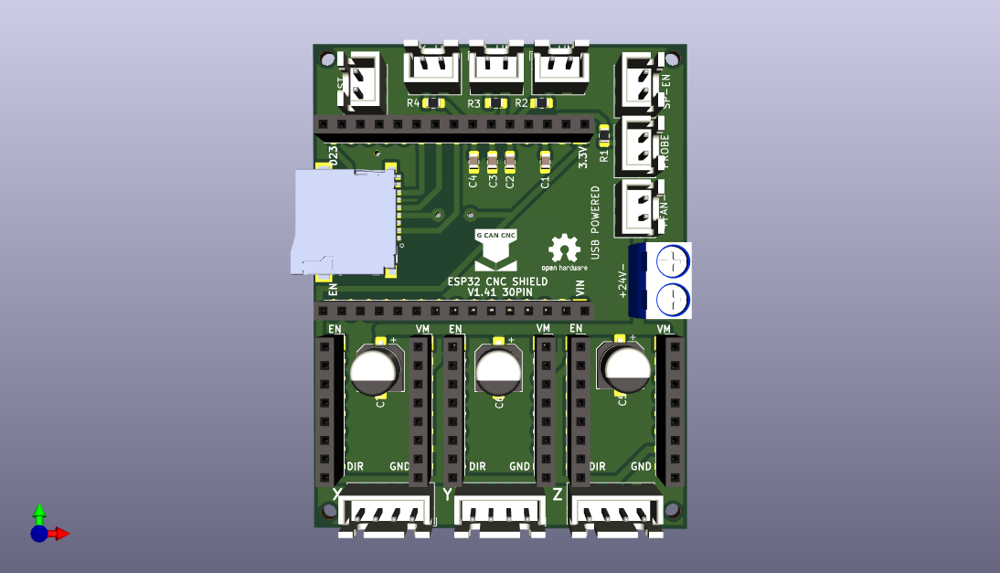

# ESP32-CNC-SHIELD-V1.4
New version of ESP32 CNC SHIELD V1.4 30PIN

 

For this version i ordered the boards SMD, made some changes: JST connectors and component emplacement.

Includes:

PCB board (54x70)

Connectors:

So you can build your own cables

3 JST Male 4x1

7 JST Male 2x1

30 Crimp terminals

Foto

My Image

In files you'll find Machines.h and /Machines/GCan_Cnc_Shield_V1.4.h.

You can find it on eBay (ESP32 CNC Shield V1.4 with SD-card reader included).

You can find a STL file for the box on my Grabcad page, look for: Enclosure for GCan Esp32 Cnc Shield v1.4.

If you want another configuration, don`t hesitate to contact me.
